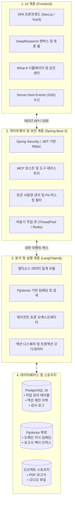
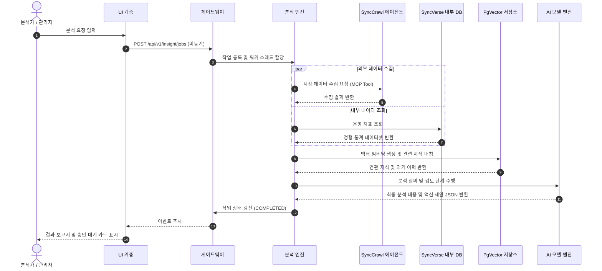

# 시스템 아키텍처 및 MCP 연동 (Architecture & Protocols)

SyncInsight는 멀티소스 데이터 처리, LLM 기반 추론 분석, 그리고 관리자 승인 기반의 액션 전달(Action Dispatching)을 수행하기 위해 3계층(3-Layer) 분산 구조를 채택하고 있습니다.

---

## 1. 3계층(3-Layer) 시스템 구조



### 1.1. UI 계층 (Frontend)
- **반응형 스트리밍**: LLM의 분석 과정과 에이전트 간 토론 내용을 Server-Sent Events(SSE) 방식으로 실시간 표시합니다.
- **블록 기반 문서 편집**: 생성된 분석 보고서를 블록 단위로 확인하고 직접 수정할 수 있는 인터페이스를 제공합니다.
- **파라미터 시뮬레이션**: 슬라이더를 통해 변수를 조정하고 예측 지표의 변화를 화면에서 바로 확인합니다.

### 1.2. 게이트웨이 및 보안 계층 (Spring Boot 3)
- **표준 API 라우팅**: REST API 요청 처리, 테넌트 분리 및 세분화된 접근 권한(RBAC) 검증을 수행합니다.
- **개인정보 보호 필터**: 외부 또는 내부 분석 엔진으로 질의가 전달되기 전 주민등록번호, 연락처 등 주요 개인식별정보(PII)를 감지하여 마스킹 처리합니다.
- **FinOps 컨트롤러**: 사용자 및 부서별 토큰 사용량을 추적하고, 사전 설정된 정책에 따라 경량 모델로의 전환을 지원합니다.

### 1.3. 분석 및 실행 계층 (Core Backend)
- **멀티소스 데이터 집계**: 내부 운영 로그(SyncVerse)와 외부 시장 수집 데이터(SyncCrawl)를 연동합니다.
- **PgVector RAG 파이프라인**: 텍스트 및 로그 데이터를 임베딩하여 유사도 검색 및 지식 기반 조회를 수행합니다.
- **액션 디스패처**: 관리자가 승인한 액션을 MCP(Model Context Protocol) 규격에 맞추어 대상 시스템에 전달합니다.

---

## 2. 데이터 처리 및 RAG 파이프라인

SyncInsight의 데이터 파이프라인은 정형 통계 데이터와 비정형 텍스트 데이터를 단계별로 결합합니다.



---

## 3. Model Context Protocol (MCP) 연동 규격

SyncInsight는 타 에이전트 및 외부 도구와의 연동을 위해 Model Context Protocol (MCP)을 지원합니다.

### 3.1. 등록된 주요 MCP 도구 목록

| 도구명 (MCP Tool) | 설명 | 파라미터 예시 |
| :--- | :--- | :--- |
| `insight_run_deep_research` | 자연어 프롬프트 기반 딥 리서치 비동기 작업 시작 | `{"prompt": "하반기 시장 트렌드 분석", "depth": "COMPREHENSIVE"}` |
| `insight_get_system_kpi` | 주요 시스템 지표 및 상태 조회 | `{"target_metric": "REVENUE", "time_range": "LAST_7_DAYS"}` |
| `insight_simulate_what_if` | 변수 변경에 따른 기대 효과 시뮬레이션 | `{"base_entity": "PROMOTION", "variables": {"discount_rate": 0.15}}` |
| `insight_dispatch_approved_action`| 승인된 액션을 대상 에이전트로 전송 | `{"action_id": "b1eebc99-...", "approval_token": "AUTH_XYZ"}` |

### 3.2. 액션 제안 Payload 구조 (JSON Schema)

```json
{
  "action_id": "b1eebc99-9c0b-4ef8-bb6d-6bb9bd380b22",
  "job_id": "a0eebc99-9c0b-4ef8-bb6d-6bb9bd380a11",
  "title": "여름 프로모션 배너 게시 및 쿠폰 등록",
  "target_agent": "SyncCMS",
  "risk_level": "LOW",
  "expected_lift": "+18.5% 예상 주문 증가",
  "payload": {
    "command": "PUBLISH_CAMPAIGN",
    "params": {
      "banner_title": "Summer Special Promotion",
      "target_route": "/events/summer-2026",
      "discount_coupon_code": "SUMMER_20",
      "discount_rate": 20,
      "auto_expire_dt": "2026-08-31T23:59:59Z"
    }
  },
  "rollback_strategy": {
    "can_rollback": true,
    "rollback_command": "UNPUBLISH_CAMPAIGN"
  }
}
```

---

## 4. 데이터베이스 테이블 설계

PostgreSQL 16 및 PgVector 확장을 활용하여 분석 작업과 액션 이력을 관리합니다.

```sql
-- 1. 분석 작업 관리 테이블
CREATE TABLE analysis_jobs (
    job_id UUID PRIMARY KEY DEFAULT gen_random_uuid(),
    requester_id VARCHAR(100) NOT NULL,
    prompt TEXT NOT NULL,
    status VARCHAR(20) NOT NULL DEFAULT 'PENDING',
    report_s3_url VARCHAR(500),
    created_at TIMESTAMP NOT NULL DEFAULT CURRENT_TIMESTAMP,
    completed_at TIMESTAMP,
    CONSTRAINT chk_analysis_jobs_status CHECK (status IN ('PENDING', 'PROCESSING', 'COMPLETED', 'FAILED'))
);

-- 2. 액션 제안 및 승인 이력 테이블
CREATE TABLE action_proposals (
    action_id UUID PRIMARY KEY DEFAULT gen_random_uuid(),
    job_id UUID NOT NULL,
    description TEXT NOT NULL,
    target_agent VARCHAR(50) NOT NULL,
    payload JSONB NOT NULL,
    status VARCHAR(20) NOT NULL DEFAULT 'PROPOSED',
    reviewed_by VARCHAR(100),
    updated_at TIMESTAMP NOT NULL DEFAULT CURRENT_TIMESTAMP,
    CONSTRAINT fk_action_proposals_job FOREIGN KEY (job_id) REFERENCES analysis_jobs(job_id) ON DELETE CASCADE,
    CONSTRAINT chk_action_proposals_status CHECK (status IN ('PROPOSED', 'APPROVED', 'REJECTED', 'EXECUTED'))
);

-- 3. 에이전트 메모리 및 지식 테이블
CREATE TABLE SYNCINSIGHT_AGENT_MEMORY (
    memory_id VARCHAR(100) PRIMARY KEY,
    agent_name VARCHAR(100) NOT NULL,
    memory_type VARCHAR(50) NOT NULL,
    context_key VARCHAR(100) NOT NULL,
    context_value TEXT NOT NULL,
    confidence_score DECIMAL(5,2) DEFAULT 1.0,
    is_hallucination BOOLEAN DEFAULT false,
    reg_dt TIMESTAMP NOT NULL DEFAULT CURRENT_TIMESTAMP
);
```

---

## 5. 트랜잭션 롤백 및 보상 처리

SyncInsight에서 승인된 액션이 외부 시스템에 전달될 때, 오류가 발생할 경우를 대비하여 보상 트랜잭션(Saga 패턴)을 구성할 수 있습니다.

1. **사전 점검(Pre-flight Validation)**: 대상 에이전트의 응답 상태를 확인합니다.
2. **순차 실행(Execution)**: 액션 단계별 결과를 기록하며 작업을 수행합니다.
3. **보상 처리(Compensating Transaction)**: 실행 중 예외가 발생하거나 관리자가 복구를 요청할 경우, 사전에 정의된 역방향 작업을 실행하여 변경 사항을 이전 상태로 복구합니다.
