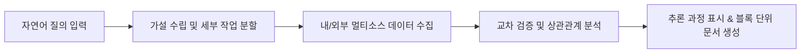
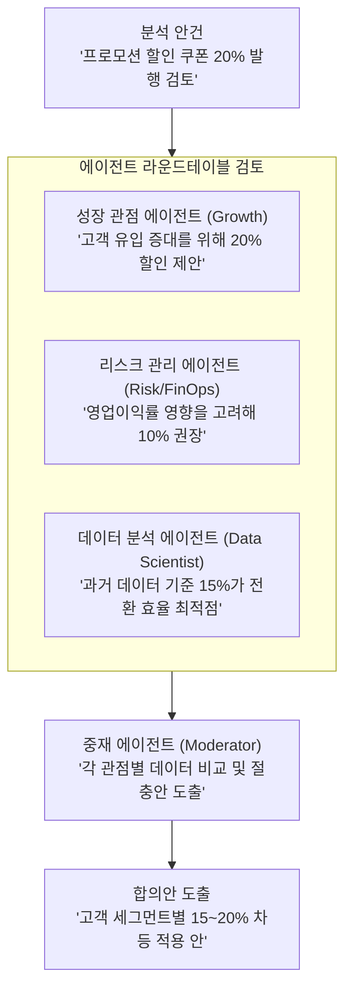

# 딥 리서치 및 에이전트 라운드테이블 토론 (Deep Research & Debate)

단순한 질의응답 형태의 AI는 편향된 결론을 내릴 수 있습니다.  
**SyncInsight**는 다각도의 분석을 지원하기 위해 **'Deep Research Engine'**과 **'Agent Roundtable Debate'** 기능을 제공하여, 여러 관점에서 교차 검증된 분석 보고서를 생성합니다.

---

## 1. DeepResearch 캔버스 (SI-005)

사용자가 입력한 분석 주제("최근 20대 고객의 결제 이탈 요인 및 경쟁사 대응 방안 분석")를 바탕으로 구조화된 심층 보고서를 작성합니다.

### 1.1. 주요 기능
* **사고 과정(Chain of Thought) 표시**: AI가 설정한 가설, 실행한 SQL 쿼리, 참조한 웹 문서 목록을 타임라인 형태로 확인할 수 있습니다.
* **블록 단위 문서 편집**: 생성된 보고서의 단락, 표, 차트를 블록 단위로 이동하거나 수정할 수 있습니다.
* **출처 주석(Citation & Grounding)**: 보고서 내 주요 수치와 분석 결론에 원본 데이터 테이블 및 출처 링크가 각주 형태로 매핑됩니다.

---

## 2. 에이전트 라운드테이블: 다중 페르소나 토론 (SI-006)

단일 모델의 분석 편향을 완화하기 위해, 서로 다른 분석 기준을 가진 복수의 에이전트가 검토 토론을 진행합니다.

### 2.1. 라운드테이블 3단계 진행 과정
1. **의견 제시(Opening)**: 각 에이전트가 부여된 역할 기준에 맞추어 데이터 근거를 제시합니다.
2. **상호 검토(Cross-Examination)**: 상대 에이전트의 데이터 해석 기준과 전제 조건을 검토합니다.
3. **절충안 도출(Consensus)**: 중재 에이전트가 각 주장의 데이터 신뢰도와 리스크 수준을 종합하여 균형 있는 대안을 보고서에 반영합니다.

> [!NOTE]
> **관리자 실시간 개입**:  
> 토론 진행 중 관리자가 우선순위 조건("이번 분기는 수익성 유지가 최우선")을 입력하면, 이를 반영하여 토론 방향이 보정됩니다.

---

## 3. 협업 캔버스 및 결재 룸 (SI-019)

의사결정권자와 분석 담당자가 보고서를 함께 검토하고 승인 절차를 진행할 수 있는 협업 환경을 제공합니다.

* **동시 접속 및 주석(Annotation)**: 여러 사용자가 보고서의 특정 단락에 메모를 남기고 피드백을 교환할 수 있습니다.
* **다자간 서명(Multi-Signature) 결재**: 사내 결재 규정에 맞추어 마케팅 책임자와 재무 책임자의 다자간 승인을 거쳐 액션이 전달되도록 구성할 수 있습니다.

---

## 4. 오디오 브리핑 (SI-013)

보고서의 핵심 내용을 빠르게 파악할 수 있도록 2~3분 분량의 음성 요약 브리핑(Audio Briefing)을 지원합니다.

* **대화형 요약 브리핑**: 주요 쟁점과 토론 결과를 문답 형태로 요약하여 오디오로 재생합니다.
* **텍스트 스크립트 연동**: 음성 재생에 맞추어 보고서 내 해당 위치가 표시됩니다.
* **챕터별 이동**: 배경 설명, 리스크 요인, 권고안 등 원하는 구간을 선택하여 청취할 수 있습니다.
