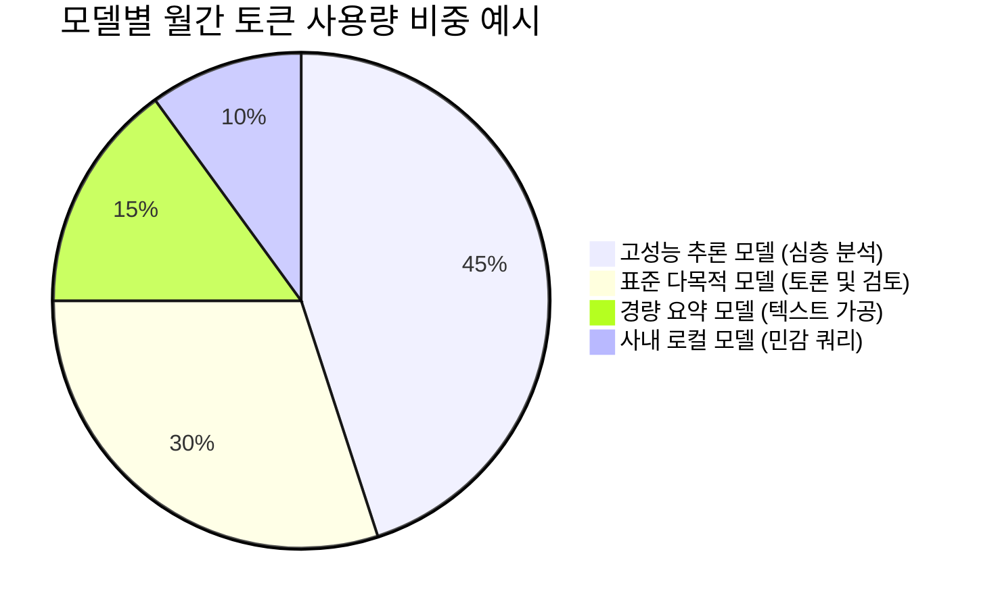
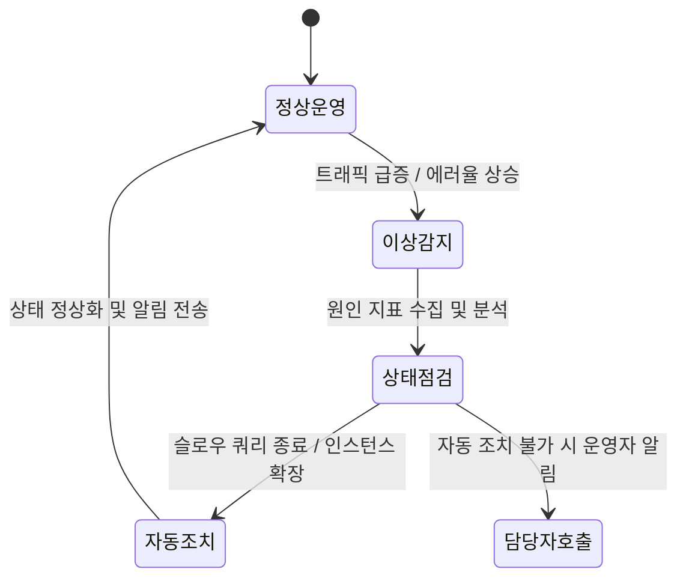

# AI FinOps, 거버넌스 및 시스템 관제 (Security & FinOps)

생성형 AI 모델을 사내 업무에 도입할 때 고려해야 할 핵심 요소는 **'LLM API 토큰 비용의 관리'**와 **'민감 데이터(PII)의 보호'**입니다.  
**SyncInsight**는 엔터프라이즈 환경에서 AI를 안정적이고 비용 효율적으로 운영할 수 있도록 **FinOps**, **개인정보 가드레일**, 그리고 **가디언 시스템 관제**를 지원합니다.

---

## 1. AI FinOps 및 토큰 사용량 관리 (SI-004)

사내 부서와 에이전트가 사용하는 모델별 토큰 사용량을 집계하고 예산 범위 내에서 관리할 수 있습니다.

### 1.1. 주요 비용 최적화 방식
1. **모델별 분기 처리 (Model Routing)**:
   - 단순 요약이나 포맷 변환 작업은 경량 모델로 라우팅하고, 다자간 토론 및 심층 리서치에 고성능 모델을 할당하여 비용을 조율합니다.
2. **시맨틱 프롬프트 캐싱 (Semantic Caching)**:
   - 동일하거나 유사한 질의 패턴에 대해 캐시된 결과를 활용하여 불필요한 중복 호출을 줄입니다.
3. **부서별 토큰 쿼터(Quota) 설정**:
   - 팀 또는 프로젝트 단위로 월별 사용량 한도를 설정하고, 임계치 도달 시 알림을 전송하거나 승인 절차로 전환할 수 있습니다.

---

## 2. AI 거버넌스 및 개인정보(PII) 마스킹 (SI-017)

민감한 고객 정보와 사내 데이터가 외부 모델로 전송되지 않도록 사전 필터링을 수행합니다.

* **자동 PII 마스킹 (Data Masking)**: 주민등록번호, 전화번호, 이메일, 계좌번호 등 주요 개인식별정보를 감지하여 식별 불가능한 형태로 치환합니다.
* **컴플라이언스 점검**: 개인정보 보호 규정에 따른 데이터 처리 이력과 감사 로그를 관리합니다.

---

## 3. 가디언 모니터 및 자동 조치 (SI-003)

시스템 및 데이터 파이프라인의 이상 징후를 감지하고 설정된 복구 시나리오를 수행합니다.

* **이상 패턴 감지**: 단순 CPU/메모리 사용률뿐만 아니라 처리 지연 시간, 작업 실패율 등 주요 운영 지표의 변동을 모니터링합니다.
* **사전 정의된 복구 조치**: 지연을 유발하는 프로세스 정리, 대체 엔드포인트로의 전환 등 준비된 시나리오에 따라 조치를 수행합니다.

---

## 4. 에이전트 간 통신 로그 및 리플레이 (SI-018)

시스템 내 에이전트 간에 송수신된 MCP 요청과 응답 로그를 기록합니다.

* **이력 조회 및 재현 (Log Replay)**: 특정 시점에 발생한 에이전트 간 메시지 흐름(Request, Response, Payload)을 순차적으로 확인합니다.
* **응답 지연 분석**: 각 구간별 처리 시간을 확인하여 성능 병목 지점을 파악할 수 있습니다.
