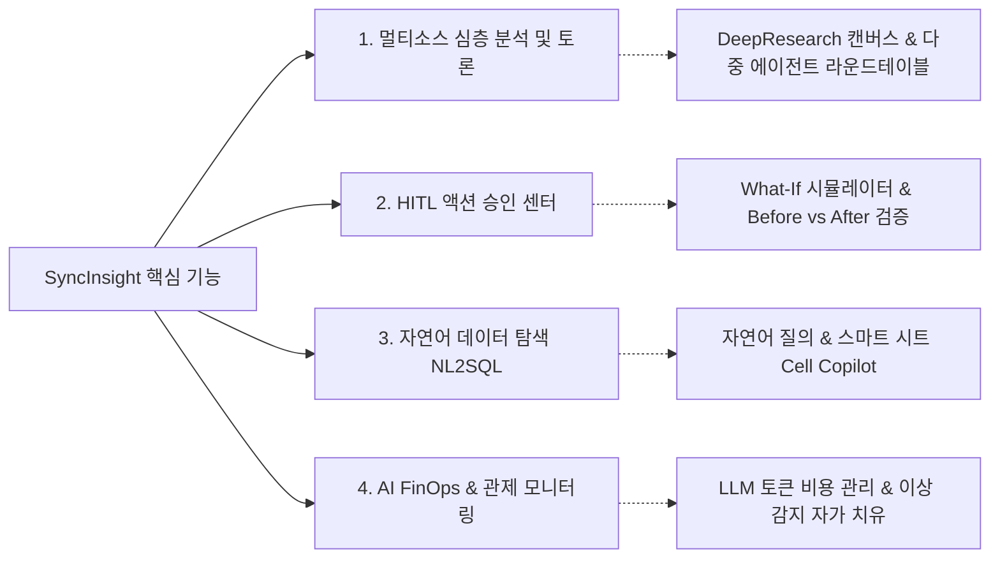
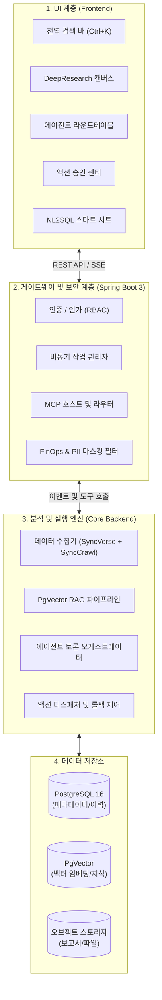

# SyncInsight: 데이터 분석 및 의사결정 지원 플랫폼

**SyncInsight**는 SyncVerse 에이전트 생태계의 데이터 분석 및 의사결정 지원(Decision Intelligence) 플랫폼입니다.

기존 비즈니스 인텔리전스(BI) 도구가 사전에 정의된 SQL 쿼리를 기반으로 과거 통계를 시각화하는 데 중점을 두었다면, SyncInsight는 **내부 운영 데이터(SyncVerse)**와 **외부 시장 데이터(SyncCrawl)**를 결합하여 원인을 분석하는 딥 리서치(Deep Research)를 수행하고, 에이전트 간 검토를 거쳐 구체적인 **실행 전략(Action Proposal)**을 제안합니다.

---

## 4대 핵심 기능

### 1. 멀티소스 심층 분석 및 에이전트 토론 (Deep Research & Debate)
- 내부 트래픽/매출 데이터와 외부 경쟁사/시장 동향을 수집하여 구조화된 분석 보고서를 생성합니다.
- 서로 다른 분석 기준(성장 지향, 리스크 관리, 통계적 유의성)을 가진 복수의 에이전트가 검토 과정을 거쳐 균형 있는 대안을 도출합니다.

### 2. 관리자 참여형(HITL) 액션 승인 센터 (Action Approval & Simulation)
- 분석 결과에 기반하여 "프로모션 배너 등록 및 할인 쿠폰 생성"과 같은 구체적인 파라미터(JSON Payload)를 생성합니다.
- 관리자가 검토 후 승인하면 **Model Context Protocol (MCP)**를 통해 대상 시스템(SyncCMS, SyncShop, SyncBoot)에 연동됩니다.
- 적용 전 **What-If 시뮬레이터**로 변수별 예상 효과를 점검하며, 문제 발생 시 직전 상태로 복구할 수 있는 보상 트랜잭션 설정을 지원합니다.

### 3. 자연어 기반 데이터 탐색 (NL2SQL & Smart Sheet)
- SQL 문법을 직접 작성하지 않고도 자연어 질의를 통해 안전한 조회용 쿼리를 생성하고 데이터를 확인할 수 있습니다.
- 스프레드시트 형태의 스마트 시트 인터페이스에서 셀 단위 보조 기능(Cell-level Copilot)을 제공합니다.

### 4. AI FinOps 및 시스템 모니터링 (FinOps & Guardian)
- 사내에서 사용되는 LLM 모델별 토큰 사용량을 집계하고, 작업 성격에 맞춘 모델 라우팅 및 캐싱을 지원합니다.
- 데이터 파이프라인 및 시스템 지표의 이상 패턴을 감지하여 사전 설정된 복구 절차를 수행합니다.

---

## 3계층(3-Layer) 시스템 구성

SyncInsight는 엔터프라이즈 환경의 보안성과 비동기 처리 성능을 고려하여 3계층 구조로 설계되었습니다.

---

## 6대 그룹 화면 구성

SyncInsight는 업무 목적에 따라 6개 그룹으로 분류된 화면을 제공합니다.

| 그룹 | 화면 ID 및 화면명 | 주요 기능 |
| :--- | :--- | :--- |
| **대시보드 및 관제** | • **SI-002 메인 대시보드** • **SI-003 가디언 모니터** • **SI-004 AI FinOps 현황** | 시스템 핵심 지표 요약, 이상 패턴 감지, LLM 사용량 모니터링 |
| **심층 분석 및 지식** | • **SI-005 DeepResearch 캔버스** • **SI-006 에이전트 라운드테이블** • **SI-019 협업 캔버스 및 결재** | 분석 보고서 작성, 다중 에이전트 검토 토론, 다자간 승인 검토 |
| **데이터 탐색** | • **SI-007 NL2SQL 탐색기** • **SI-008 스마트 시트** • **SI-020 온톨로지 뷰어** | 자연어 질의 기반 SQL 생성, 그리드 기반 셀 분석, 데이터 관계도 시각화 |
| **액션 및 시뮬레이션**| • **SI-009 액션 승인 센터** • **SI-010 What-If 시뮬레이터** • **SI-011 워크플로우 빌더** | 제안 전략 승인/반려, 변수 변경에 따른 영향도 추정, 프로세스 설계 |
| **보고서 및 평가** | • **SI-012 보고서 보관소 & RAG** • **SI-013 오디오 브리핑** • **SI-014 AI 품질 평가 센터** | 과거 보고서 검색, 음성 요약 재생, 생성 결과물 피드백 관리 |
| **MCP 및 설정** | • **SI-015 에이전트 토폴로지** • **SI-016 MCP 도구 관리** • **SI-017 거버넌스 관리** • **SI-018 통신 로그 스트림** | 연결 상태 시각화, 도구 파라미터 점검, 개인정보 마스킹 설정, 로그 확인 |

---

## 세부 기술 안내

* [시스템 아키텍처 및 MCP 연동](architecture): 시스템 구성 및 통신 규격 상세
* [딥 리서치 및 에이전트 토론](deep-research): 다중 관점 검토 및 보고서 작성 방식
* [자율 액션 승인 및 What-If](action-approval): 관리자 승인 절차 및 시뮬레이션 설정
* [NL2SQL 및 스마트 시트](nl2sql-and-data): 자연어 질의 및 데이터 그리드 활용
* [AI FinOps 및 시스템 보안](finops-and-security): 토큰 사용량 관리 및 개인정보 보호 설정
* [빠른 시작 가이드](quickstart): Docker Compose 기반 로컬 구동 및 초기 설정
