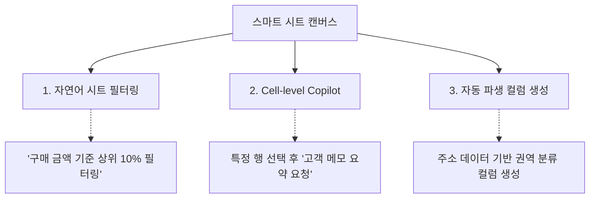

# NL2SQL 포탈 및 스마트 시트 데이터 탐색기 (Data Exploration)

데이터를 조회하고 분석하기 위해 SQL 쿼리를 직접 작성하기 어려운 환경에서도, **SyncInsight**는 자연어를 데이터베이스 조회문으로 변환하는 **'NL2SQL Portal'**과 스프레드시트 방식의 **'Smart Sheet Canvas'**를 통해 효율적인 데이터 탐색을 지원합니다.

---

## 1. NL2SQL 포탈 탐색기 (SI-007)

자연어로 질문을 입력하면, 사전에 등록된 스키마 정보를 기반으로 조회용 SQL 구문을 생성하고 결과를 화면에 표시합니다.

### 1.1. 3분할 화면 레이아웃 구성
1. **상단 질의 영역**: 사용자의 자연어 프롬프트 입력 및 자주 사용하는 예시 질의 칩을 제공합니다.
2. **좌측 SQL 검증 영역**: 생성된 SQL 구문과 실행 계획(Explain Plan), 쿼리의 세부 조건 설명을 확인할 수 있습니다.
3. **우측 데이터 시각화 영역**: 조회 결과를 반응형 그리드 및 차트(바 차트, 선 그래프 등)로 시각화합니다.

### 1.2. 쿼리 안전성 검증 기준
* **읽기 전용 제한 (Read-Only Enforcement)**: `SELECT` 구문만 허용하며 `INSERT`, `UPDATE`, `DELETE`, `DROP` 등 데이터 변경 및 삭제 구문은 실행되지 않습니다.
* **조회 건수 제한 (Limit Protection)**: 대량 데이터 조회로 인한 데이터베이스 부하를 방지하기 위해 기본 `LIMIT` 설정이 적용됩니다.
* **파라미터 바인딩**: 동적 바인딩 방식을 적용하여 SQL 인젝션을 방어합니다.

---

## 2. 스마트 시트 캔버스 (SI-008)

스프레드시트 형태의 그리드 환경에서 데이터 분석 및 가공 작업을 수행할 수 있습니다.

### 2.1. 주요 기능
* **자연어 시트 필터**: 조건 필터링 창을 복잡하게 설정하지 않고, "성장률이 전월 대비 하락한 항목만 표시"와 같은 명령으로 데이터를 필터링합니다.
* **셀 단위 AI 보조 (Inline Cell Copilot)**: 특정 셀이나 행을 선택하고 가공을 지시하면 행 전체의 맥락을 고려하여 요약, 분류, 감성 분석 결과를 입력합니다.
* **파일 내보내기**: 작업한 데이터를 CSV 또는 Excel 포맷으로 다운로드할 수 있습니다.

---

## 3. 데이터 맥락 및 온톨로지 뷰어 (SI-020)

주요 데이터베이스 테이블 간의 연관 관계와 출처를 지식 그래프 형태로 시각화합니다.

* **데이터 리니지(Data Lineage) 추적**: 특정 지표나 컬럼이 어떤 원천 테이블에서 생성되고 가공되었는지 단계별 이력을 추적할 수 있습니다.
* **온톨로지 맵**: 비즈니스 도메인 엔티티(회원, 주문, 상품 등) 간의 연결 구조를 시각화하여 데이터 정합성을 점검할 수 있습니다.
