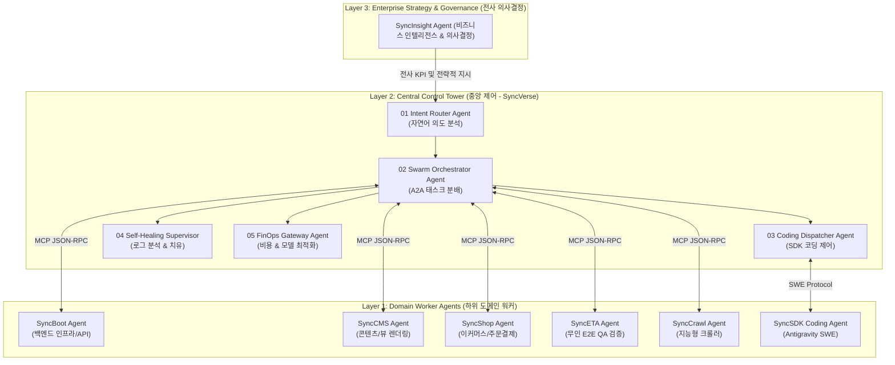
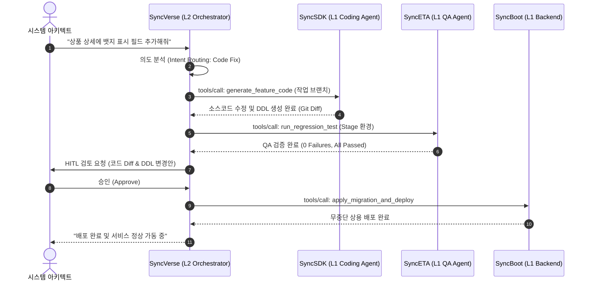

# 3-Layer 멀티 에이전트 아키텍처 및 A2A 통신

SyncVerse는 복잡한 엔터프라이즈 시스템을 체계적으로 운영하기 위해 **3-Layer 계층형 에이전트 아키텍처**와 **표준 MCP(Model Context Protocol) 기반의 Agent-to-Agent(A2A) 통신망**을 채택하고 있습니다.

---

## 1. 3-Layer 에이전트 계층 구조

에이전트 간의 책임과 권한을 3개 계층으로 명확히 분리하여, 단일 장애점(SPOF)을 방지하고 보안과 실행 신뢰성을 확보합니다.



### 계층별 세부 역할

1. **Layer 3: 전사 거버넌스 및 전략 의사결정 (Strategic Layer)**
   - **주요 에이전트**: `SyncInsight Agent`
   - **역할**: 전사 비즈니스 메트릭, 트래픽 변화, 마케팅 데이터를 분석하여 상위 레벨의 운영 전략 및 액션 플랜을 Layer 2 관제탑으로 전달합니다.

2. **Layer 2: 중앙 관제탑 및 오케스트레이션 (Control Tower Layer - SyncVerse)**
   - **주요 에이전트**: `Intent Router`, `Swarm Orchestrator`, `Coding Dispatcher`, `Self-Healing Supervisor`, `FinOps Gateway`
   - **역할**: 자연어 요구사항을 구체적인 시스템 액션 플랜으로 변환하고, 하위 워커 에이전트 간의 의존성 및 순차/병렬 작업을 조율하며, 트랜잭션과 비용을 관리합니다.

3. **Layer 1: 도메인 특화 워커 에이전트 (Domain Worker Layer)**
   - **주요 에이전트**: `SyncBoot`, `SyncCMS`, `SyncShop`, `SyncETA`, `SyncCrawl`, `SyncSDK`
   - **역할**: 각 도메인의 핵심 비즈니스 로직(DB CRUD, 페이지 렌더링, 주문 처리, 무인 QA 테스트, 코드 수정 등)을 직접 수행합니다.

---

## 2. A2A 통신 프로토콜 (Model Context Protocol)

SyncVerse 내 모든 에이전트 간 통신은 오픈 표준인 **MCP(Model Context Protocol)** 및 **JSON-RPC 2.0**을 기반으로 동작합니다.

### 통신 시퀀스 다이어그램



### 표준 MCP 요청/응답 페이로드 명세

#### 에이전트 도구 호출 요청 (Request Payload)
```json
{
  "jsonrpc": "2.0",
  "id": "req-syncverse-98213",
  "method": "tools/call",
  "params": {
    "name": "syncboot_apply_migration",
    "arguments": {
      "targetService": "product-service",
      "ddlScript": "ALTER TABLE tb_product ADD COLUMN badge_type VARCHAR(20) DEFAULT 'NONE';",
      "safeMode": true,
      "timeoutSeconds": 30
    }
  }
}
```

#### 에이전트 실행 결과 응답 (Response Payload)
```json
{
  "jsonrpc": "2.0",
  "id": "req-syncverse-98213",
  "result": {
    "content": [
      {
        "type": "text",
        "text": "Migration successfully applied. 0 rows affected. DDL lock released."
      }
    ],
    "isError": false,
    "metadata": {
      "executionTimeMs": 142,
      "affectedTables": ["tb_product"]
    }
  }
}
```

---

## 3. 기술 스택 및 런타임 아키텍처

SyncVerse는 엔터프라이즈 환경의 대규모 트래픽과 무중단 운영을 지원하기 위해 다음 기술 스택을 채택합니다.

| 계층 | 기술 스택 | 도입 목적 |
| :--- | :--- | :--- |
| **Backend Core** | Java 17+, Spring Boot 3.x | 엔터프라이즈 런타임, 트랜잭션 관리 |
| **AI Framework** | **LangChain4j** (`langchain4j-spring-boot-starter`) | 전사 표준 AI 프레임워크, LLM 도구 연동, RAG 체인 |
| **Frontend UI** | Vue 3, TypeScript, Vite, **Vue Flow** | 노드-엣지 토폴로지 시각화, 관제 대시보드 |
| **State & Cache** | Redis 7.x (Cluster) | 에이전트 실시간 상태 공유, 시맨틱 캐싱, 분산 락 |
| **Database** | PostgreSQL 15+ / MySQL 8.x | RDBMS 데이터 정합성, JSONB 감사 로그 영속화 |
| **Infrastructure** | Docker, Kubernetes, GitHub Actions | 컨테이너 기반 격리 실행, CI/CD 배포 파이프라인 |