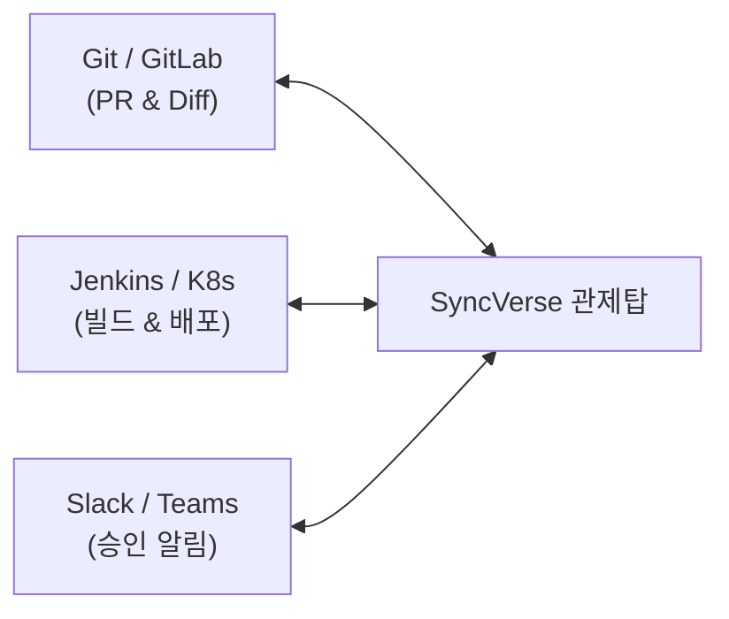

---
title: "엔터프라이즈 도입 FAQ 및 프라이빗 AI 보안"
description: "SyncVerse 도입을 검토 중인 엔터프라이즈 고객을 위한 자주 묻는 질문(FAQ), 사내 폐쇄망 온프레미스 프라이빗 AI 구축 방안, 기존 CI/CD 및 Git 시스템 연동 가이드입니다."
head:
  - - meta
    - name: keywords
      content: SyncVerse, Enterprise FAQ, 온프레미스, 프라이빗 AI, 폐쇄망, Ollama, vLLM, Git 연동, Jenkins 연동, Kubernetes
  - - meta
    - property: og:title
      content: "SyncVerse: 엔터프라이즈 도입 FAQ 및 프라이빗 AI 보안"
  - - meta
    - property: og:description
      content: "사내 온프레미스 구축부터 기존 시스템 연동까지 엔터프라이즈 도입 핵심 FAQ"
sort: 10
---

# 엔터프라이즈 도입 FAQ 및 프라이빗 AI 보안

SyncVerse를 실제 기업 환경에 도입하기 위해 고객사 아키텍트와 보안 담당자가 자주 문의하는 질문과 기술적 답변을 정리했습니다.

---

## 1. 보안 및 프라이빗 AI 환경

### Q1. 사내 소스코드와 데이터가 외부 AI 벤더(OpenAI 등)로 전송되지 않도록 구성할 수 있나요?
> **A. 사내 폐쇄망(Air-Gapped) 및 온프레미스 구성이 가능합니다.**  
> SyncVerse는 사내에 구축된 오픈소스 LLM(vLLM, Ollama, 사내 파인튜닝된 Llama 3 / Qwen 등) 및 사내 GPU 서버와의 연동을 지원합니다. 또한 상용 클라우드 LLM을 사용하는 경우에도 **PII 자동 마스킹 필터**와 **엔터프라이즈 전용 데이터 미학습(Zero Data Retention) 엔드포인트**를 통해 데이터를 안전하게 보호합니다.

### Q2. AI가 실수로 상용 데이터베이스를 손상시킬 위험은 없나요?
> **A. HITL(Human-In-The-Loop) 거버넌스로 사전에 차단됩니다.**  
> `ALTER TABLE`, `DROP` 등 모든 스키마 변경 DDL과 상용(Production) 배포는 에이전트 단독으로 실행할 수 없으며, 시스템 아키텍트의 명시적 승인 및 2FA 인증을 거쳐야만 실행됩니다.

---

## 2. 기존 인프라 및 시스템 연동

### Q3. 현재 사용 중인 Git, CI/CD, 사내 메신저와 연동할 수 있나요?
> **A. 표준 엔터프라이즈 인프라와의 연동 인터페이스를 제공합니다.**  
> - **형상관리**: GitHub, GitLab, Bitbucket (작업 브랜치 생성, PR 발행, 코드 Diff 대조)
> - **CI/CD 파이프라인**: Jenkins, GitHub Actions, GitLab CI, ArgoCD
> - **컨테이너 오케스트레이션**: Kubernetes, Docker Compose
> - **협업 도구**: Slack, Microsoft Teams, Jira, Dooray (승인 요청 알림 및 상태 조회)

### Q4. Java Spring Boot 외에 다른 언어로 개발된 레거시 시스템도 지원하나요?
> **A. 네, 지원합니다.**  
> SyncVerse는 표준 **Model Context Protocol (MCP)**과 **REST/JSON-RPC** 통신을 사용하므로, Python(FastAPI), Node.js(NestJS), Go, C# 등 어떤 언어로 작성된 마이크로서비스라도 표준 MCP Server 래퍼를 연결하면 관제탑에 편입할 수 있습니다.

---

## 3. 도입 절차 및 PoC 로드맵

### 1단계: 준비 및 PoC (2주 ~ 4주)
- 대상 도메인 서비스 1개를 선정하여 SyncVerse 관제탑 연동
- 대상 서비스 Git 저장소 및 SyncBoot, SyncCMS, SyncETA 에이전트 MCP 등록
- 인텐트 라우팅 정확도 및 자연어 지시 수행 테스트

### 2단계: 시범 운영 (4주 ~ 8주)
- 개발/스테이징(Dev/Stage) 환경에서 무인 QA 및 자가치유 파이프라인 가동
- 아키텍트 HITL 승인 콘솔 적용 및 기능 배포 리드타임(TTM) 단축 측정

### 3단계: 전사 AI DLC 생태계 확산 (이후)
- 전사 마이크로서비스로 관제탑 확대 적용
- SyncInsight 연동을 통한 비즈니스 데이터-개발 실행 연동

---

## 4. 라이선스 및 기술 지원

SyncVerse는 오픈소스 커뮤니티 에디션과 기업용 엔터프라이즈 에디션을 제공합니다.
- **도입 문의 및 PoC 지원**: `contact@empasy.com`
- **공식 기술 지원 포털**: [https://empasy.io](https://empasy.io)