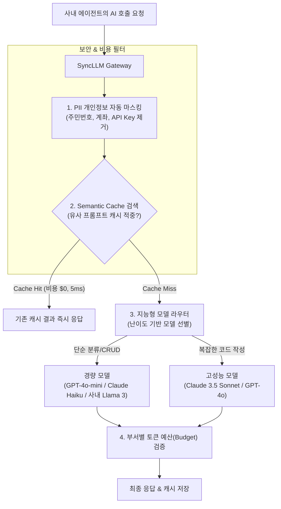

# SyncLLM 게이트웨이 & FinOps 비용 최적화

사내 여러 팀과 에이전트들이 제각각 상용 LLM API(OpenAI, Anthropic, Google 등)를 호출하면 **비용 통제 분산, 중복 호출로 인한 토큰 낭비, 민감 개인정보(PII) 유출 위험**이 발생할 수 있습니다.

SyncVerse의 **FinOps Gateway Agent (SyncLLM)**는 모든 AI 요청을 일원화된 게이트웨이로 관리하여 **보안을 강화하고 API 비용을 체계적으로 최적화**합니다.

---

## 1. FinOps 게이트웨이 4대 핵심 기능



---

## 2. 시맨틱 캐싱 (Semantic Cache Lookup)

기존의 단순 문자열 일치(Exact Match) 캐싱은 어미나 띄어쓰기 차이로 인해 재사용률이 낮습니다.

SyncLLM은 **임베딩 벡터 유사도(Cosine Similarity $\ge 0.95$)** 기반의 시맨틱 캐싱을 지원합니다.
- *"상품 목록 조회 API 작성해줘"*
- *"상품 리스트 가져오는 API 코드 작성해줘"*

두 요청의 의미적 유사도를 판별하여 외부 LLM 호출 없이 기존 캐시된 결과를 즉시 반환함으로써 응답 지연과 토큰 비용을 줄입니다.

---

## 3. PII(개인정보) 실시간 자동 마스킹

외부 LLM 벤더로 데이터가 전송되기 전, 게이트웨이 단에서 민감 정보(주민등록번호, 전화번호, 이메일, 신용카드 번호, 내부 DB 접속 패스워드 등)를 정규식 및 NER(개체명 인식)로 탐지하여 가명/마스킹 처리합니다.

```json
// LLM 전송 전 자동 마스킹 변환 예시
{
  "originalPrompt": "고객 홍길동(010-1234-5678, 900101-1234567)의 주문 취소 처리해줘",
  "sanitizedPrompt": "고객 [MASK_USER_1]([MASK_PHONE_1], [MASK_RRN_1])의 주문 취소 처리해줘"
}
```

---

## 4. 부서별 토큰 예산(Budget) 한도 통제

관리자 콘솔에서 부서별, 프로젝트별로 월간 AI 토큰 소비 한도를 지정할 수 있습니다.
- **경고 임계치 (80%)**: 관리자에게 알림 발송
- **최대 한도 도달 (100%)**: 비핵심 에이전트의 고급 모델 호출을 제한하고 경량 모델로 다운그레이드