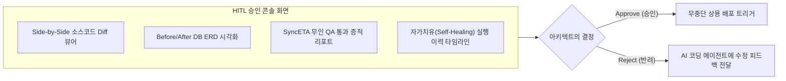

# 엔터프라이즈 HITL 거버넌스 및 승인 콘솔

AI 에이전트가 데이터베이스 스키마(DDL)를 임의로 변경하거나, 검증되지 않은 코드를 상용 환경에 배포하는 위험을 방지해야 합니다.

SyncVerse는 **"코드 생성과 테스트는 AI가 신속히 지원하되, 아키텍처 결정과 배포는 시스템 아키텍트가 최종 승인한다"**는 **HITL (Human-In-The-Loop)** 거버넌스 모델을 채택하고 있습니다.

---

## 1. AI와 사람의 역할 분담 매트릭스 (R&R)

| 운영 단계 | AI 에이전트 그룹이 수행하는 작업 | 시스템 아키텍트 (사람)가 수행하는 작업 |
| :--- | :--- | :--- |
| **01. 요구사항 분석** | 자연어 지시 해석, 영향도 분석, 태스크 분해 | 목표와 요구사항을 자연어로 제시 |
| **02. 소스 수정 & DDL** | 작업 브랜치 생성, 코드 Diff 및 마이그레이션 DDL 작성 | *(개입 없음 - AI가 자율 수행)* |
| **03. 무인 QA & 자가치유** | 자동 빌드, E2E 리그레션 테스트, 에러 로그 기반 자가 패치 | *(개입 없음 - AI가 자율 수행)* |
| **04. 검토 및 승인 게이트** | 변경 요약 리포트, ERD 변경 다이어그램, Diff 시각화 제공 | **제안된 코드 Diff와 DDL의 적합성 검토 후 승인/반려 결정** |
| **05. 상용 배포 & 감사** | Blue/Green 무중단 배포, Saga 트랜잭션 커밋, 감사 이력 영속화 | 비상 상황 시 긴급 정지(Kill-Switch) 트리거 |

---

## 2. HITL 승인 콘솔의 핵심 기능

중앙 관제탑 웹 콘솔의 **[HITL 승인 대시보드]**에서는 아키텍트가 신속하게 변경사항을 검토할 수 있도록 시각적 도구를 제공합니다.

1. **Side-by-Side 코드 Diff 뷰어**: AI가 수정한 소스코드가 기존 파일과 어떻게 다른지 대조
2. **ERD 마이그레이션 시각화**: 테이블 추가/수정 DDL이 전체 DB 관계도에 미치는 영향을 그래픽으로 표현
3. **QA 테스트 증적 뷰어**: SyncETA가 실행한 모든 테스트 케이스의 통과 여부 및 실행 시간 확인
4. **반려 시 피드백 프롬프트 주입**: 반려 시 보완 지시사항을 입력하면 에이전트가 즉시 재수정 작업 착수

---

## 3. 엔터프라이즈 안전장치 (Security Guardrails)

### 1) 상용(Prod) 배포 2단계 인증 (2FA / OTP)
중요 시스템의 상용 배포 승인 시, 인가된 시스템 아키텍트의 모바일 OTP 또는 사내 SSO 2단계 인증을 거쳐야만 배포 파이프라인이 실행됩니다.

### 2) DDL 파괴적 변경 차단 정책 (Anti-Destructive DDL Guard)
`DROP TABLE`, `DROP COLUMN`, 대규모 `TRUNCATE` 등 데이터 유실 위험이 있는 DDL은 AI가 생성할 수 없도록 사전에 차단되어 있습니다. 필요한 경우 '소프트 삭제(Soft Delete)' 또는 'Deprecation 플래그' 방식으로 대체 제안됩니다.

### 3) 전사 비상 전체 정지 (Emergency Kill-Switch)
시스템 이상 징후나 비정상 동작이 감지될 경우, 대시보드의 **[Kill-Switch]**를 작동시키면 가동 중인 모든 에이전트의 작업이 즉각 안전하게 중단(Safe Halt)되고 커넥션이 격리됩니다.