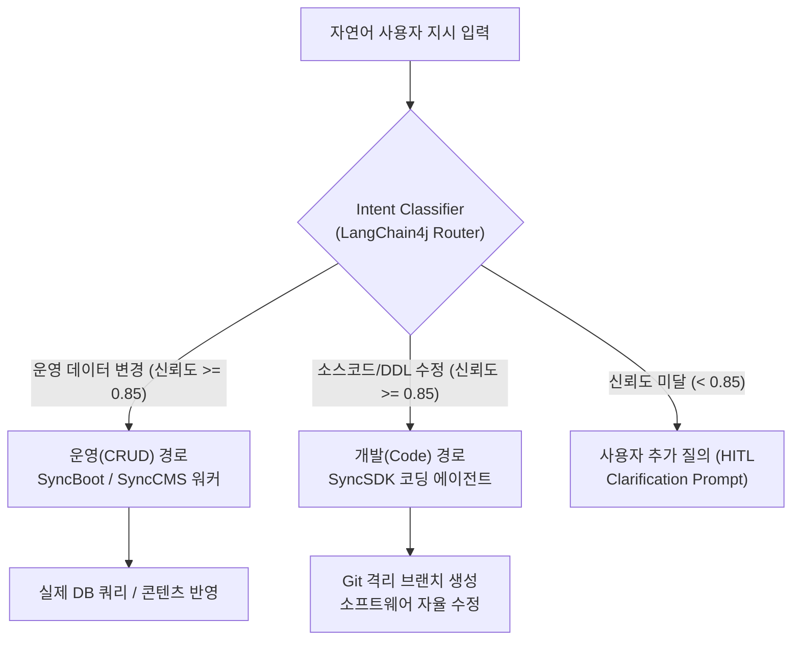
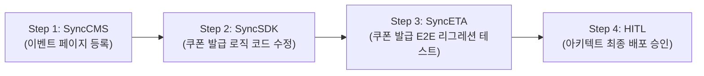

# 인텐트 라우팅 엔진 (Intent Routing Engine)

SyncVerse의 **인텐트 라우팅 엔진(Intent Routing Engine)**은 시스템에 유입되는 모든 자연어 지시를 분석하여 작업의 성격을 규명하고, 가장 적합한 도메인 에이전트와 도구 체인으로 분배하는 핵심 진입점(Entry Point)입니다.

---

## 1. 운영(CRUD) vs 개발(Code)의 분리

SyncVerse는 시스템 안정성을 위해 **데이터 운영 작업**과 **소스코드 변경 작업**의 경로를 명확히 분리하여 운영합니다.



### 카테고리별 분류 기준

| 작업 분류 (Intent Type) | 설명 및 예시 | 호출 에이전트 | 코드 접근 권한 |
| :--- | :--- | :--- | :---: |
| **`OPS_DATA_CRUD`** | "VIP 회원 등급 기준을 100만원으로 수정해줘" | `SyncBoot`, `SyncShop` | 제한 (DB DML만 허용) |
| **`OPS_CONTENT_UPDATE`**| "메인 배너 문구를 여름 프로모션으로 바꿔줘" | `SyncCMS` | 제한 (콘텐츠 API만 허용) |
| **`DEV_CODE_FIX`** | "결제 취소 시 포인트 환불 누락되는 버그 수정해줘" | `SyncSDK`, `SyncETA` | 허용 (작업 브랜치 내) |
| **`DEV_NEW_FEATURE`** | "회원가입 시 카카오 간편로그인 OAuth 연동 추가해줘"| `SyncSDK`, `SyncBoot` | 허용 (작업 브랜치 내) |
| **`QA_VERIFICATION`** | "장바구니 결제 플로우 E2E 테스트 다시 실행해줘" | `SyncETA` | 제한 (테스트 런타임만) |

---

## 2. 신뢰도 점수 (Confidence Score) 거버넌스

의도 분석의 오류로 인해 작업이 잘못된 경로로 전달되는 것을 방지하기 위해 **Confidence Score 임계값(기본 0.85)** 정책을 적용합니다.

- **신뢰도 $\ge 0.85$**: 지정된 에이전트 파이프라인으로 자동 디스패치
- **신뢰도 $< 0.85$**: 모호한 지시로 판별하여 사용자에게 확인 모달을 제시하고 추가 입력 요청

---

## 3. 복합 요구사항 다중 태스크 자동 분해 (Task Decomposition)

현업 담당자가 여러 작업을 복합적으로 요청할 경우, 엔진이 이를 단위 작업으로 분해하여 실행 체인(DAG)을 구성합니다.

### 복합 요청 예시:
> *"신규 이벤트 페이지를 등록하고, 쿠폰 발급 로직에 1인 1회 제한 유효성 검사 코드를 추가한 뒤, 테스트를 돌려줘."*

### 분해 결과 (DAG 체인):


---

## 4. 사내 RAG 아키텍처 컨텍스트 주입

정확한 의도 분류 및 코드 수정을 위해, 시스템은 사내 프로젝트의 아키텍처 명세서, DB 스키마 DDL, 도메인 용어집(Glossary)을 프롬프트에 결합(Prompt Augmentation)하여 모델에 전달합니다.

```java
// SyncVerse 내부 IntentRouterService (LangChain4j 기반)
@Service
public class IntentRouterService {

    private final ChatLanguageModel chatModel;
    private final ProjectContextRetriever contextRetriever;

    public RoutingResult route(String userPrompt, Long projectId) {
        // 1. 사내 프로젝트 컨텍스트 및 DB 스키마 RAG 검색
        String domainContext = contextRetriever.retrieveContext(projectId, userPrompt);

        // 2. 구조화된 프롬프트 생성
        Prompt prompt = IntentPromptTemplate.create(userPrompt, domainContext);

        // 3. LLM 라우터 추론 및 구조화된 JSON 결과 반환
        return chatModel.generate(prompt, RoutingResult.class);
    }
}
```