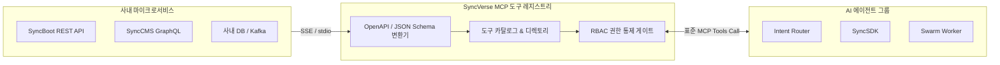

# MCP 도구 레지스트리 및 RBAC 권한 관리

SyncVerse는 사내 마이크로서비스와 외부 도구들을 **Model Context Protocol (MCP)** 표준 인터페이스로 통합하여 관리합니다.

중앙 관제탑의 **MCP 도구 레지스트리(MCP Tool Registry)**를 통해 전사 도구 카탈로그를 조회하고, 각 도구의 입출력 스키마를 검증하며, 실행 권한(RBAC)을 통제할 수 있습니다.

---

## 1. 표준 MCP 도구 등록 및 아키텍처



---

## 2. JSON Schema 기반 파라미터 유효성 검증

등록된 모든 MCP Tool은 엄격한 JSON Schema를 기반으로 정의되어, 잘못된 파라미터 호출을 사전에 차단합니다.

### 도구 명세 예시 (`syncboot_create_entity`):
```json
{
  "name": "syncboot_create_entity",
  "description": "지정된 도메인 모듈에 신규 JPA Entity 클래스 및 DDL 스크립트를 생성합니다.",
  "inputSchema": {
    "type": "object",
    "properties": {
      "moduleName": {
        "type": "string",
        "enum": ["member", "order", "product", "coupon"]
      },
      "entityName": {
        "type": "string",
        "pattern": "^[A-Z][a-zA-Z0-9]+$"
      },
      "fields": {
        "type": "array",
        "items": {
          "type": "object",
          "properties": {
            "name": { "type": "string" },
            "type": { "type": "string", "enum": ["String", "Long", "Integer", "LocalDateTime", "Boolean"] },
            "nullable": { "type": "boolean" }
          },
          "required": ["name", "type"]
        }
      }
    },
    "required": ["moduleName", "entityName", "fields"]
  }
}
```

---

## 3. 도구별 세분화 권한 관리 (Fine-grained RBAC)

모든 에이전트가 모든 도구를 실행할 수 있는 것은 아닙니다. 시스템 보안 등급에 따라 에이전트 및 사용자 역할별로 실행 권한을 제어합니다.

| 도구 보안 등급 | 도구 예시 | 허용 에이전트 | 관리자 승인 여부 |
| :--- | :--- | :--- | :---: |
| **Level 1 (Read-Only)** | `query_schema`, `get_logs`, `search_api` | 모든 워커 에이전트 | 자동 허용 |
| **Level 2 (Data Write)** | `insert_record`, `publish_content` | `SyncBoot`, `SyncCMS` | 정책 기반 허용 |
| **Level 3 (Code Edit)** | `checkout_branch`, `modify_source` | `SyncSDK Coding Agent` | 자동 빌드 후 검증 |
| **Level 4 (Critical DDL)**| `alter_table`, `deploy_production` | 없음 (에이전트 단독 실행 불가) | **아키텍트 승인 필수** |

---

## 4. OpenAPI / Swagger 기반 MCP 변환

이미 사내에서 운영 중인 Spring Boot REST API를 표준 MCP 도구로 변환하여 등록할 수 있습니다.

1. 관제탑 콘솔에서 사내 마이크로서비스의 `swagger.json` 또는 `openapi.yaml` URL 입력
2. 엔드포인트 선택 및 MCP 도구 이름 매핑
3. `[MCP 서버 등록]` 클릭 시 전사 에이전트가 호출 가능한 도구로 활성화