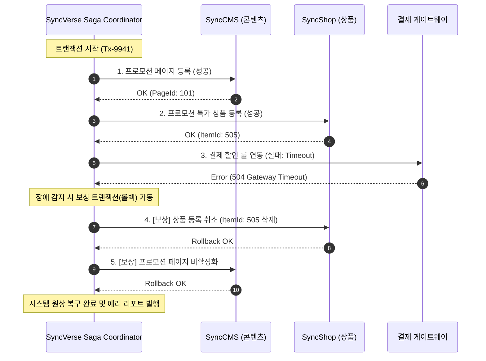

# Saga 분산 트랜잭션 & 전사 감사 추적

멀티 에이전트 환경에서는 하나의 사용자 지시가 여러 시스템(`SyncBoot`, `SyncCMS`, `SyncShop` 등)의 API를 연속적으로 호출합니다. 이때 중간 단계에서 오류가 발생하면 **일부 시스템에만 데이터가 반영되어 데이터 불일치(Data Inconsistency)가 발생**할 수 있습니다.

SyncVerse는 **Saga 오케스트레이션 패턴**과 **전수 감사 추적(Audit Trail)**을 통해 시스템의 데이터 정합성과 컴플라이언스 신뢰성을 관리합니다.

---

## 1. Saga 분산 트랜잭션 및 보상 롤백 메커니즘

SyncVerse 중앙 오케스트레이터는 작업 체인을 단계별 트랜잭션으로 정의하고, 각 단계마다 대응하는 **보상 트랜잭션(Compensating Transaction)**을 사전에 등록합니다.



---

## 2. 작업 상태(State) 영속화 및 장애 복구

오케스트레이션 중 서버가 불시에 재부팅되거나 네트워크가 단절되어도 작업 상태가 유실되지 않도록 **Redis Cluster 및 PostgreSQL**에 트랜잭션 스냅샷을 영속화합니다.

- **State Machine 영속화**: `PENDING` $\rightarrow$ `EXECUTING` $\rightarrow$ `COMPENSATED` $\rightarrow$ `COMMITTED`
- **멱등성(Idempotency) 보장**: 모든 에이전트 도구 호출에 고유한 `Idempotency-Key`를 부여하여 중복 실행 방지
- **타임아웃 & 서킷 브레이커**: 개별 도구 호출 지연 시 자동 타임아웃 처리 후 롤백 경로로 진입

---

## 3. 전사 A2A 감사 추적 (Audit Trail & Compliance)

보안 규제 준수를 위해, 시스템 내에서 일어난 모든 활동을 감사 로그로 기록합니다.

```json
{
  "auditId": "audit-20260823-0091",
  "timestamp": "2026-08-23T07:15:00Z",
  "actor": {
    "type": "USER",
    "userId": "architect_kim",
    "ipAddress": "10.0.12.44"
  },
  "action": "HITL_APPROVE_DEPLOYMENT",
  "targetService": "syncboot-product-api",
  "changes": {
    "commitHash": "a7b8c9d",
    "ddlExecuted": "ALTER TABLE tb_product ADD COLUMN discount_rate NUMERIC(5,2);",
    "approverOtpVerified": true
  },
  "subAgentTraces": [
    {
      "agent": "IntentRouterAgent",
      "model": "gpt-4o-mini",
      "tokensUsed": 340
    },
    {
      "agent": "SyncSDKCodingAgent",
      "model": "claude-3-5-sonnet",
      "tokensUsed": 2150
    }
  ]
}
```

### 감사 콘솔에서 조회 가능한 정보:
1. **지시자 및 승인자 정보/IP**: 어떤 사용자가 작업을 지시하고 상용 배포를 승인했는지
2. **에이전트별 프롬프트 및 도구 호출 전수 기록**: 에이전트가 어떤 판단을 내리고 어떤 파라미터로 도구를 실행했는지
3. **토큰 소모량 및 소요 시간**: 각 단계별 비용 및 레이턴시