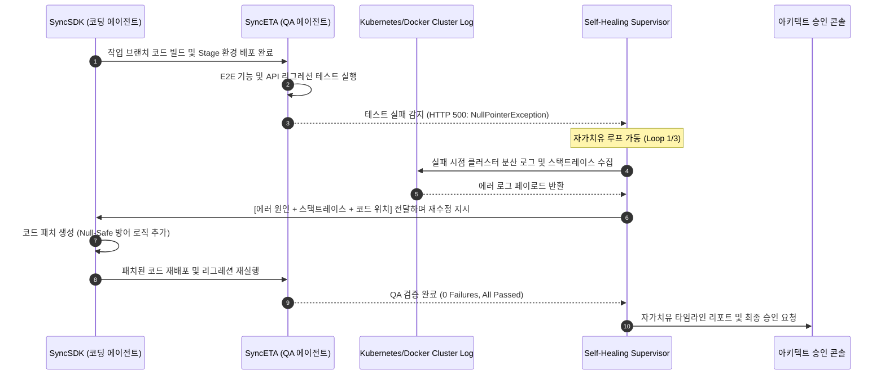

# 자가치유 파이프라인 (Self-Healing Pipeline)

전통적인 소프트웨어 개발에서는 QA 단계에서 결함이 발견되면 **[개발자 호출 $\rightarrow$ 로그 수동 수집 $\rightarrow$ 로컬 디버깅 $\rightarrow$ 코드 재수정 $\rightarrow$ 재빌드 $\rightarrow$ 재배포]**로 이어지는 절차가 필요했습니다.

SyncVerse의 **자가치유 파이프라인(Self-Healing Pipeline)**은 이 과정을 에이전트 간의 A2A 협업으로 자동화하여 처리 시간을 대폭 단축합니다.

---

## 1. 자가치유 4단계 루프 (The Self-Healing Loop)



---

## 2. 세부 동작 메커니즘

### 1) 결함 감지 및 이상 징후 포착 (SyncETA)
SyncETA 에이전트가 Stage 환경에 배포된 애플리케이션을 대상으로 API 단위 테스트, UI 시나리오 E2E 테스트를 수행합니다. 어설션(Assertion) 실패 또는 HTTP 5xx 응답이 감지되면 즉시 `Self-Healing Supervisor` 에이전트에 장애 이벤트를 발행합니다.

### 2) 클러스터 분산 로그 자동 수집 (Log Harvester)
`Self-Healing Supervisor`는 컨테이너 클러스터(Docker/Kubernetes/Spring Boot Logback)에서 에러가 발생한 트랜잭션 ID(Trace-Id)와 연관된 전체 로그를 추출합니다.

```json
{
  "traceId": "trace-77a8-4c12-9901",
  "errorType": "java.lang.NullPointerException",
  "exceptionMessage": "Cannot invoke \"String.trim()\" because \"userCoupon.getCouponCode()\" is null",
  "culpritClass": "com.empasy.syncshop.service.CouponService",
  "culpritLine": 142,
  "stackTraceSnippet": "at com.empasy.syncshop.service.CouponService.applyCoupon(CouponService.java:142)..."
}
```

### 3) 원인 분석 및 SDK 코드 재수정 (SyncSDK)
코딩 에이전트는 원본 소스코드, 실패한 테스트 케이스, 그리고 수집된 로그 스택트레이스를 결합하여 버그의 원인을 분석하고 방어 코드를 작성합니다.

```diff
// CouponService.java 수정 예시
- if (userCoupon.getCouponCode().trim().isEmpty()) {
+ if (userCoupon.getCouponCode() == null || userCoupon.getCouponCode().trim().isEmpty()) {
      throw new BusinessException(ErrorCode.INVALID_COUPON_CODE);
  }
```

### 4) 회귀 검증 및 안전 종료
수정된 코드를 다시 빌드하여 SyncETA에게 전달합니다. SyncETA는 실패했던 테스트뿐만 아니라 전체 리그레션 테스트 슈트를 재실행하여 다른 기능에 부작용(Side-effect)이 없는지 검증합니다.

---

## 3. 무한 루프 방지 및 안전장치 (Safety Rails)

자가치유 과정이 반복되어 토큰이나 서버 리소스가 불필요하게 소모되는 것을 방지하기 위해 다음 정책을 적용합니다.

- **최대 재시도 횟수(Max Retry Limit)**: 기본 **최대 3회**로 제한. 3회 내에 해결되지 않으면 즉시 서킷 브레이커가 동작하고 담당 개발자에게 에스컬레이션됩니다.
- **서킷 브레이커(Circuit Breaker)**: 동일한 에러가 2회 연속 동일 패턴으로 수정 실패할 경우 즉시 작업을 중단합니다.
- **감사 타임라인 시각화**: 자가치유가 발생한 전 과정(로그 $\rightarrow$ Diff $\rightarrow$ 테스트 결과)을 관리자 화면에 타임라인 형태로 상세하게 기록합니다.